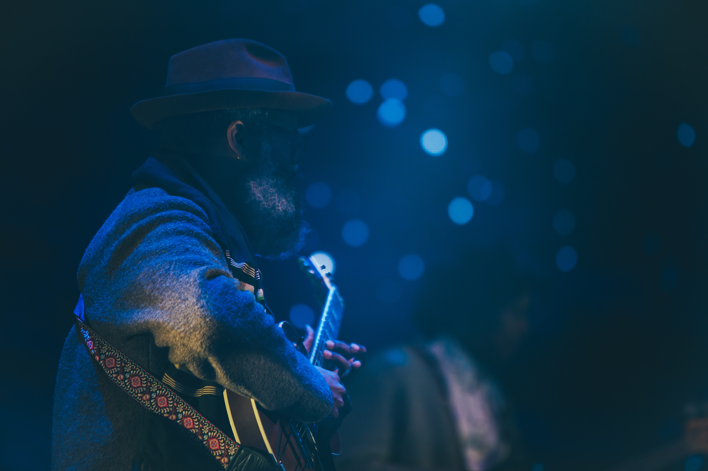

<!-- markdownlint-disable MD033 -->

<figure class="figure">
    
    <figcaption class="figure__caption">Title</figcaption>
</figure>

# Blues

[Source: Wikipedia](https://en.wikipedia.org/wiki/Blues)

Blues is a music genre and musical form originated in the Deep South of the United States around the 1870s. The genre developed from roots, and spirituals. Blues incorporated spirituals, work songs, field hollers, shouts, chants, and rhymed simple narrative ballads. The blues form, ubiquitous in jazz, rhythm and blues and rock and roll, is characterized by the call-and-response pattern, the blues scale and specific chord progressions, of which the twelve-bar blues is the most common. Blue notes (or "worried notes"), usually thirds or fifths flattened in pitch, are also an essential part of the sound. Blues shuffles or walking bass reinforce the trance-like rhythm and form a repetitive effect known as the groove.

## Etymology

[Source: Wikipedia](https://en.wikipedia.org/wiki/Blues)

<figure class="figure">
    
    <figcaption class="figure__caption">Title</figcaption>
</figure>

The term blues may have come from "blue devils", meaning melancholy and sadness; an early use of the term in this sense is in George Colman's one-act farce Blue Devils (1798). The phrase blue devils may also have been derived from Britain in the 1600s, when the term referred to the "intense visual hallucinations that can accompany severe alcohol withdrawal". As time went on, the phrase lost the reference to devils, and "it came to mean a state of agitation or depression." By the 1800s in the United States, the term blues was associated with drinking alcohol, a meaning which survives in the phrase blue law, which prohibits the sale of alcohol on Sunday. Though the use of the phrase in African-American music may be older, it has been attested to in print since 1912, when Hart Wand's "Dallas Blues" became the first copyrighted blues composition.

In lyrics the phrase is often used to describe a depressed mood. It is in this sense of a sad state of mind that one of the earliest recorded references to "the blues" was written by Charlotte Forten, then aged 25, in her diary on 14 December 1862. She was a free-born black from Pennsylvania who was working as a schoolteacher in South Carolina, instructing both slaves and freedmen, and wrote that she "came home with the blues" because she felt lonesome and pitied herself. She overcame her depression and later noted a number of songs, such as Poor Rosy, that were popular among the slaves. Although she admitted being unable to describe the manner of singing she heard, Forten wrote that the songs "can't be sung without a full heart and a troubled spirit", conditions that have inspired countless blues songs.
